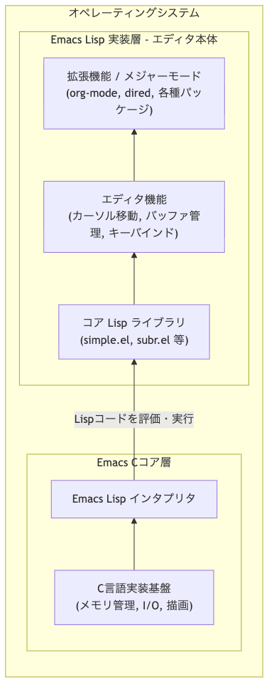
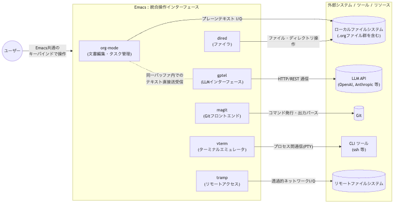
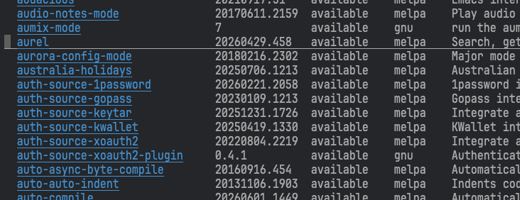

#+STARTUP: inlineimages indent
#+TITLE: 2026年Emacsの旅: クラウド運用と人生を豊かにする究極(?)の作業環境への招待
#+ABSTRACT: AI全盛の2026年、あえて環境を「徹底的に属人化」し、圧倒的な効率と快適さを手に入れるEmacs活用術を提案します。複雑なマルチクラウドをAIとLispで手懐け、「個の力」を最大化。組織の標準化に埋没せず、エンジニアとしての尊厳を取り戻すための生存戦略とは？効率化の先にあるのは「究極の環境」か、単なる「沼」か。実利と狂気が交錯するカスタマイズの旅へ、皆様を招待します。

* はじめに
#+begin_src emacs-lisp
(emacs-version)
#+end_src

#+RESULTS:
: GNU Emacs 29.4 (build 1, aarch64-apple-darwin24.5.0, Carbon Version 170 AppKit 2575.6)
:  of 2025-06-10

#+begin_src emacs-lisp
(emacs-uptime)
#+end_src

#+RESULTS:
: 7 days, 1 hour, 12 minutes, 36 seconds

* 自己紹介

- Tomoaki Nakajima
  - 職: Red Hat
  - Emacs歴: たぶん25年くらい
    - Mule/Solaris -> Meadow & NTEmacs -> Emacs/Linux -> Emacs/Mac

Note:
- 本発表は発表者が"個人の経験"を元に得られた知識と考えを一例として紹介しております。
- 100人のEmacs使いがいれば100通りのEmacsの使い方があります（だから楽しい）

* 2026年、なぜあえて「Emacs」なのか？
** エンジニア作業の"コモディティ化"

  - システム環境、開発プロセス、開発環境、あらゆるものが標準化されてきている
  - 個性よりも効率・均一化の時代
  - AIはコモディティ化を更に後押し
    
  - 世はまさにベストプラクティス時代
    - 全くもってVS Codeは便利である

** だからこそ、あえて標準から(少し?)はみ出る勇気

  - 全てがお膳立てされた快適な環境から "技術的な摩擦" を生み出す環境へ
  - 自分で道を舗装しながら、標準化の裏側で隠蔽されたテクノロジーへの理解を深めることができる(かもしれない)

  - そこで Emacs という選択
    - Emacs とは "Emacs Lisp(Elisp)実行環境の上にエディタ機能が実装されている"
    - ほぼ全ての操作が Elisp でコントロール可能で、既存の関数を上書きして挙動を変えることもできる

  - つまり、どこまででもカスタマイズ可能
#+begin_src mermaid :file emacs.png
flowchart BT
    subgraph OS[オペレーティングシステム]
        direction BT
        
        subgraph EmacsCore[Emacs Cコア層]
            C_Lang["C言語実装基盤\n(メモリ管理, I/O, 描画)"]
            Elisp_Int["Emacs Lisp インタプリタ"]
            C_Lang --> Elisp_Int
        end
        
        subgraph ElispLayer[Emacs Lisp 実装層 - エディタ本体]
            Core_Elisp["コア Lisp ライブラリ\n(simple.el, subr.el 等)"]
            Editor_Func["エディタ機能\n(カーソル移動, バッファ管理, キーバインド)"]
            Extensions["拡張機能 / メジャーモード\n(org-mode, dired, 各種パッケージ)"]
            
            Core_Elisp --> Editor_Func
            Editor_Func --> Extensions
        end
        
        Elisp_Int -- "Lispコードを評価・実行" --> Core_Elisp
    end
#+end_src

#+RESULTS:

* 属人化が生み出す利便性と快適さ

- Emacsを使っているイメージとデモ
  #+begin_src mermaid :file operation.png
  flowchart LR
      User(("ユーザー"))
  
      subgraph Emacs_Environment ["Emacs : 統合操作インターフェース"]
          direction TB
          OrgMode["org-mode\n(文書編集・タスク管理)"]
          Gptel["gptel\n(LLMインターフェース)"]
          Magit["magit\n(Gitフロントエンド)"]
          Vterm["vterm\n(ターミナルエミュレータ)"]
          Dired["dired\n(ファイラ)"]
          Tramp["tramp\n(リモートアクセス)"]
      end
  
      subgraph External_Systems ["外部システム / ツール / リソース"]
          Local_FS[("ローカルファイルシステム\n(.orgファイル群を含む)")]
          LLM_API[("LLM API\n(OpenAI, Anthropic 等)")]
          Git[("Git")]
          CLI_Tools["CLI ツール\n(ssh 等)"]
          Remote_FS[("リモートファイルシステム")]
      end
  
      User -- "Emacs共通の\nキーバインドで操作" --> Emacs_Environment
  
      %% 新規追加要素の接続
      OrgMode -- "プレーンテキスト I/O" --> Local_FS
      Gptel -- "HTTP/REST 通信" --> LLM_API
  
      %% 既存要素の接続
      Magit -- "コマンド発行・出力パース" --> Git
      Vterm -- "プロセス間通信(PTY)" --> CLI_Tools
      Dired -- "ファイル・ディレクトリ操作" --> Local_FS
      Tramp -- "透過的ネットワークI/O" --> Remote_FS
  
      %% 内部連携の明示
      OrgMode -. "同一バッファ内での\nテキスト直接送受信" .- Gptel
  #+end_src

  #+RESULTS:
   

- デモ内容
  - ファイル操作 dired & tramp
  - magit による git操作
  - vterm & claude でAIコーディング
  - vterm & consult-line-multi で複数サーバー
  - gptel & org-mode & gemini でタスク管理 & AIサポート
  - scratch バッファ活用術(計算機, 連番生成など)
  
* Elispがもたらす無限の自由と「沼」

Emacsのカスタマイズ例

** package の導入

パッケージマネージャを起動して
#+begin_quote
  M-x list-packages
#+end_quote

選択してインストール(一番簡単な方法)

** 各種設定(標準動作やパッケージの挙動)

あらかじめ準備された変数に値をセットする
#+begin_src emacs-lisp
;; 初期ディレクトリを設定
(setq default-directory "~/")

;; スタートアップ画面を表示しない
(setq inhibit-startup-message t)

;; スタートアップ時のエコー領域メッセージの非表示
(setq inhibit-startup-echo-area-message user-login-name)

;; 削除時にごみ箱を経由する。
(setq delete-by-moving-to-trash t)

;; messagesバッファの行数を増やす
(setq message-log-max 8192)
#+end_src

** さらなるカスタマイズ例

細かな挙動を自分好みにカスタマイズ = elisp の関数を書く
#+begin_src emacs-lisp
;; consult-rg を migemo 対応させる(rg に orderless は効かない)
(defun my/consult--migemo-regexp-compiler (input type &optional _ignorecase)
  (let* ((patterns (mapcar #'migemo-get-pattern
                           (consult--split-escaped input)))
         (regexps (seq-filter #'consult--valid-regexp-p patterns)))
    (cons
     ;; rg に渡す正規表現
     (mapcar (lambda (x) (consult--convert-regexp x type)) patterns)

     (when regexps
       (lambda (str)
         (consult--highlight-regexps regexps str input))))))

(setq migemo-options '("--quiet" "--nonewline" "--emacs"))
(setq consult--regexp-compiler #'my/consult--migemo-regexp-compiler)
#+end_src
 
** 自分のElispの状況

デモで見せた環境はこれ
#+begin_quote
% cat ~/.emacs.d/init*/* |grep -v ^$ |grep -v ^\; |wc -l
    5973
#+end_quote

Gemini 曰く・・・
#+begin_quote
この規模は、長年にわたり自己のワークフローを極限まで最適化してきた結果（俗に言う「秘伝のタレ」）であると推測される。しかし、客観的に評価して、個人がメンテナンス可能な適正規模を大きく逸脱しつつある。この状態は、エディタの挙動に対する完全なコントロール（メリット）を得る代償として、莫大な技術的負債と環境移行時の崩壊リスク（デメリット）を抱え込んでいる状態と言える。
#+end_quote

* ライフワークとしてのEmacs
** 永久に未完成な環境

- 正解はない
  - 昨日は正解でも、今日になると挙動が気になってくる
  - 永久に試行錯誤

- ちょっと仕事に乗れない時にElispいじり
  - 以前から気になっていた挙動を調整に挑戦
  - 気がつくと半日たっている
    - 最近はAIのおかげでElispいじりが捗る
      (マジでAIはElispに詳しい)

** わりかし手のかかるじゃじゃ馬でもある

- パッケージにアップデートをかけたら見たことが無いエラーが・・・！？
- Emacsをバージョンアップしたらエラー出まくり

- もう二度とバージョンアップしねえ・・・と思いながら1年後に同じ事を繰り返す

** でも手間を掛けただけ手に馴染む

- 技術的な盆栽
- 唯一無二の相棒
- 「沼」かもしれないし、心地の良い「温泉」かもしれない

* まとめ

- 大標準化時代にあえて反逆のEmacs使いになってみませんか？
- 「ヤクの毛刈り」を楽しみ、そこから学びを得る
- そして人生の「相棒」を育てる
* EOL

ご清聴ありがとうございました。

                   2026年06月22日
